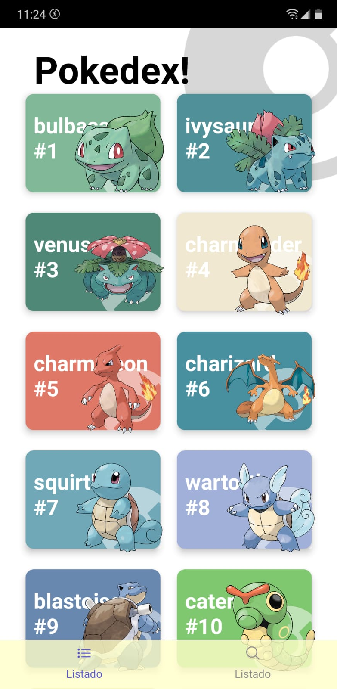
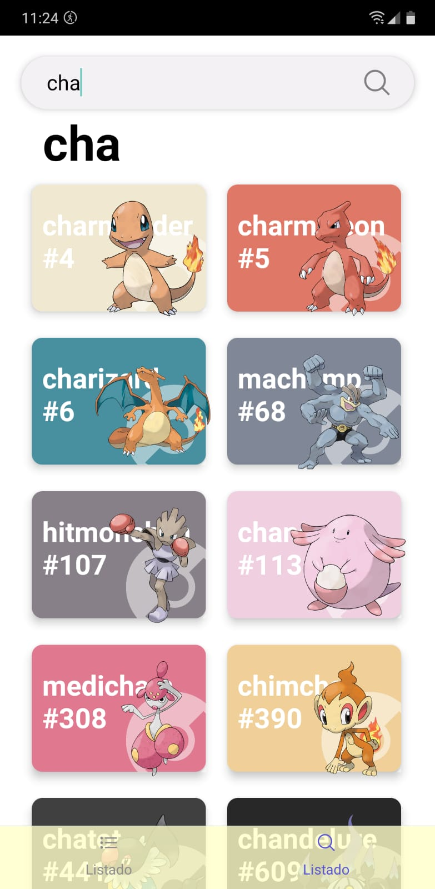
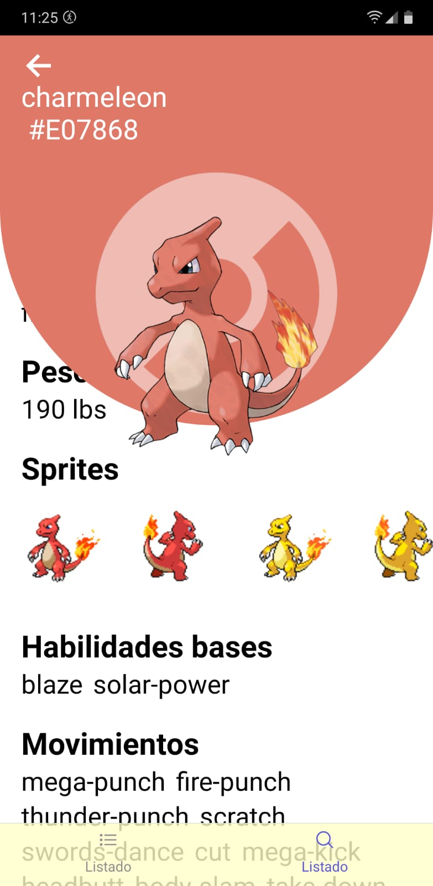

# Pokedex App!

- Pokemons library, an app with 2 navigations types (STACK & TABS navigations)
- Customs hooks to fetch <a href="https://pokeapi.co/api/v2/pokemon">POKE API</a> 
- FadeIn component, to show an infinite scroll of pokemons

Snaps:
1. Home Screen:

  

2. Search Screen with debounce:

  

3. Details Screen:

  

4. Custom app icon:

  

 
 
 
 

This examples are part from the [React Native: Aplicaciones nativas para IOS y Android course](https://www.udemy.com/course/react-native-fh/)